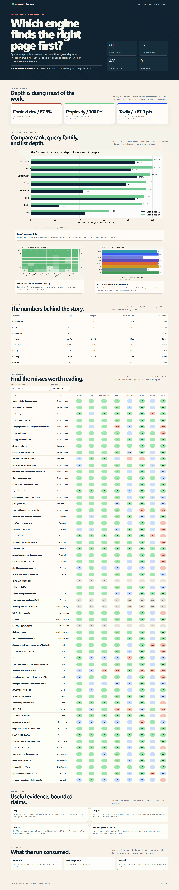
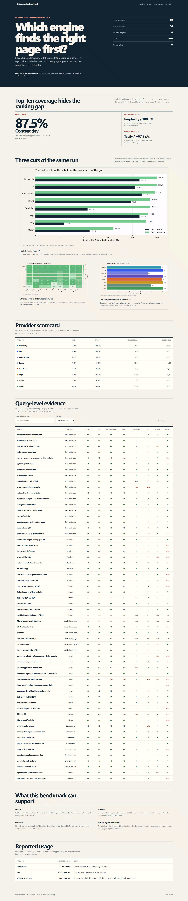

# ui-unslop

A Codex skill for removing formulaic AI styling from frontend UI.

## Original baseline

An earlier cleanup pass improved this Octen Anchor benchmark report but stopped with residual formulaic styling. The current skill treats that result as incomplete and keeps working until its full-surface gates pass.

| Before | After |
| --- | --- |
|  |  |
