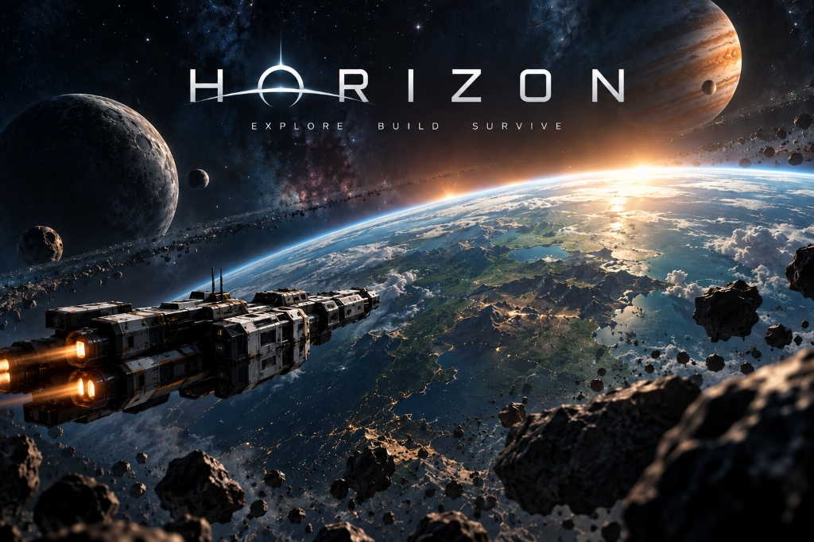

# Horizon: Explore Build Survive

Projekt 2D w silniku **Godot 4**.
Gra polegająca na nawigacji statkiem kosmicznym, przemieszczaniu się między planetami, lądowaniu na ich powierzchni, wydobywaniu surowców i przetrwaniu w otwartej przestrzeni.

## Systemy
* **Własna fizyka grawitacyjna i orbitalna** — pełna symulacja orbit ciał niebieskich (symulacja Keplera i transfery orbit).
* **Autopilot (FSM)** — zaawansowana maszyna stanów sterująca napędem (planowanie manewrów Hohmanna, płynne naprowadzanie).
* **Tryb powierzchni** — płynne i skalowalne przejście z symulacji kosmosu do lotu przy powierzchni planety.
* **Rozszerzony HUD** — telemetria lotu, panel celów nawigacyjnych, mini-mapa, oraz opcje zaawansowanego przyspieszania czasu (Time Warp).
